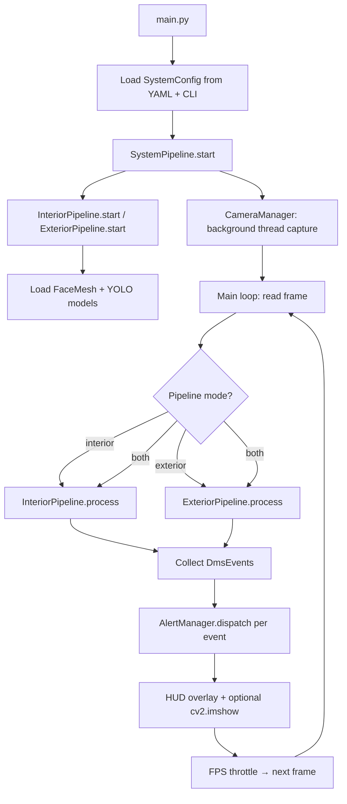
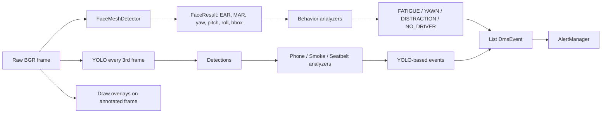

# Driver Monitoring System — Project Insights

This document summarizes the **Driver Monitoring & Vehicle Safety System (DMS)** based on the README and codebase. It covers purpose, technology stack, architecture, runtime flow, and roadmap.

---

## 1. Project Overview

| Aspect | Description |
|--------|-------------|
| **Name** | Driver Monitoring & Vehicle Safety System (DMS) |
| **Purpose** | Real-time monitoring of driver state and (partially) vehicle surroundings to detect unsafe behaviors and emit alerts |
| **Target platforms** | Raspberry Pi 4 (edge deployment) and PC (development / demo) |
| **Design goal** | Low-latency edge inference without cloud dependency |
| **License** | MIT |
| **Version** | Demo v1 (interior features largely complete; exterior mostly stubbed for v2) |

The system ingests live video from one or more cameras, runs computer-vision models on each frame, applies stateful behavior logic, and dispatches alerts through console, on-screen overlay, and optional sound.

---

## 2. Key Insights

### What the project does well

- **Edge-first design** — Models and thresholds are tuned for CPU-only inference on Pi (320×240, YOLO every 3rd frame, MediaPipe without iris refinement).
- **Clear separation of concerns** — Detectors produce raw signals; behavior analyzers turn them into events; pipelines orchestrate; alerts are centralized.
- **Dual pipeline model** — Interior (driver-facing) and exterior (road-facing) can run independently or together.
- **Configurable without code changes** — `src/config/default.yaml` plus CLI flags control camera, thresholds, and pipeline mode.
- **Graceful degradation** — If YOLO fails to load, face-based monitoring continues; headless mode (`--no-show`) saves CPU on Pi.

### Current limitations (v1)

- **Smoke and seatbelt** — Rely on custom YOLO weights; README marks them as stubs needing fine-tuned models.
- **Exterior safety** — Lane departure, collision warning, distance alarm, and reverse-camera events are defined in `EventType` but not fully implemented (motion detection is active).
- **Single-camera assumption in `both` mode** — Interior and exterior pipelines share one `CameraManager` frame; true dual-camera setups would need architectural extension.

### Planned evolution (v2)

Road-facing features: lane departure, front-car collision, pedestrian collision, distance alarm, camera cover detection, and reverse-camera events.

---

## 3. Technology Stack

### Core language & runtime

| Technology | Role |
|------------|------|
| **Python 3** | Application language |
| **venv** | Isolated dependencies (Pi uses `--system-site-packages` for system OpenCV/Picamera2) |

### Computer vision & ML

| Library / Model | Version / Notes | Usage |
|-----------------|-----------------|--------|
| **OpenCV** (`opencv-python`) | ≥ 4.8.0 | Capture, display, drawing, frame differencing (motion), image ops |
| **MediaPipe FaceMesh** | 0.10.14 | 468 facial landmarks; EAR, MAR, head pose (PnP) |
| **Ultralytics YOLOv8n** | ≥ 8.0.0 | Object detection (phone class 67, vehicles, persons); custom weights for smoke/seatbelt |
| **NumPy** | ≥ 1.24.0 | Array math for landmarks and frames |

### Configuration & operations

| Technology | Role |
|------------|------|
| **PyYAML** | Load `default.yaml` into dataclass config (`SystemConfig`) |
| **psutil** | CPU/RAM metrics in HUD |
| **argparse** | CLI in `main.py` |
| **logging** | Centralized via `src/utils/logger.py` |

### Platform-specific (optional)

| Technology | Role |
|------------|------|
| **Picamera2** | Raspberry Pi CSI camera (apt install; auto-detected) |
| **pygame** | Optional sound alerts (commented in `requirements.txt`) |

### Detection techniques (not separate libraries)

| Technique | Event(s) |
|-----------|----------|
| **EAR** (Eye Aspect Ratio) | `FATIGUE_DRIVING` |
| **MAR** (Mouth Aspect Ratio) | `DRIVER_YAWNS` |
| **Head pose (yaw/pitch via PnP)** | `DRIVER_UNDER_DISTRACTION` |
| **Face absence counter** | `NO_DRIVER` |
| **YOLO class 67** | `DRIVER_CALL` (cell phone) |
| **Custom YOLO classes** | `DRIVER_SMOKE`, `SEAT_BELT_DETECTION` (needs training) |
| **Frame differencing** | `MOTION_DETECTION` (exterior) |

---

## 4. Project Structure

```
Driver-Monitoring-System/
├── main.py                    # Entry: parse args → load config → SystemPipeline
├── demo_test.py               # Headless smoke test (no camera)
├── setup_weights.py           # Download YOLO weights
├── requirements.txt
├── src/
│   ├── camera/                # Threaded capture (OpenCV / Picamera2)
│   ├── config/                # YAML + dataclass settings
│   ├── detectors/             # FaceMesh + YOLO wrappers
│   ├── pipelines/             # Interior, exterior, system orchestrator
│   ├── behaviors/             # Stateful analyzers → DmsEvent
│   ├── alerts/                # Event types + AlertManager
│   └── utils/                 # Drawing, metrics, platform detect, logging
└── weights/                   # Model files (gitignored)
```

---

## 5. System Flow

### 5.1 High-level lifecycle



### 5.2 Startup sequence

1. **Parse CLI** — camera index, config path, pipeline mode (`interior` | `exterior` | `both`), display, resolution, FPS target.
2. **Load configuration** — Merge YAML defaults with CLI overrides into `SystemConfig`.
3. **Construct `SystemPipeline`** — Creates `CameraManager`, `AlertManager`, `PerformanceMonitor`, and selected pipelines.
4. **`start()`** — Starts camera thread; initializes detectors in each pipeline; waits up to ~2.5s for first frame.
5. **`run()`** — Blocking main loop until quit (q/ESC), screenshot (`s`), or window close.

### 5.3 Per-frame processing (interior)



**Interior behavior logic (stateful):**

- **Fatigue** — EAR below threshold for N consecutive frames → `FATIGUE_DRIVING` (CRITICAL).
- **Yawn** — MAR above threshold for N frames → `DRIVER_YAWNS`.
- **Distraction** — Head yaw/pitch beyond thresholds for N frames → `DRIVER_UNDER_DISTRACTION`.
- **No driver** — No face detected for sustained period → `NO_DRIVER`.
- **Phone / smoke / seatbelt** — YOLO detections matched to class labels → respective events (phone uses COCO class 67).

### 5.4 Per-frame processing (exterior)

1. Convert frame to grayscale + Gaussian blur.
2. **Motion detection** — Compare with previous frame via `cv2.absdiff`; if sum exceeds threshold → `MOTION_DETECTION`.
3. **YOLO** — Detect person, car, bus, truck (classes 0, 2, 5, 7); draw boxes (collision/TTC logic is v2).
4. **Lane stub** — Visual placeholder only; no `LANE_DEPARTURE` events yet.

### 5.5 Alert dispatch

For each `DmsEvent`:

1. **Cooldown check** — Per `EventType`, default 3s (`alert.cooldown_seconds`).
2. **Console** — Colored log by severity (INFO / WARNING / CRITICAL).
3. **Overlay queue** — Recent events shown in HUD via `draw_hud`.
4. **Sound** — Optional pygame playback if enabled.

### 5.6 Shutdown

`SIGINT` / `SIGTERM` or quit key → `pipeline.stop()` → release FaceMesh, stop camera thread, destroy OpenCV windows.

---

## 6. Supported Events (v1 status)

| Event | Detection method | Status |
|-------|------------------|--------|
| `FATIGUE_DRIVING` | EAR + consecutive frames | Active |
| `DRIVER_YAWNS` | MAR + consecutive frames | Active |
| `DRIVER_UNDER_DISTRACTION` | Head pose (yaw/pitch) | Active |
| `NO_DRIVER` | Face absence | Active |
| `DRIVER_CALL` | YOLOv8n class 67 (cell phone) | Active |
| `DRIVER_SMOKE` | Custom YOLO weights | Stub — needs fine-tuning |
| `SEAT_BELT_DETECTION` | Custom YOLO weights | Stub — needs fine-tuning |
| `MOTION_DETECTION` | Frame differencing | Active (exterior) |
| Lane / collision / distance / reverse | — | Planned v2 |

---

## 7. Configuration & Performance

### Main config file: `src/config/default.yaml`

- **Camera** — resolution, FPS target, Picamera2 toggle, buffer size.
- **MediaPipe** — EAR/MAR thresholds, consecutive frame counts, distraction angles.
- **YOLO** — model path, confidence, image size (320 on Pi), device (`cpu`).
- **Alert** — sound, console, overlay, cooldown.
- **Display** — window, landmarks, metrics HUD.
- **Pipeline** — default mode `interior`.

### Pi optimization patterns

- Lower resolution (320×240) and FPS target (15).
- `refine_landmarks: false` (~20% CPU savings).
- YOLO `imgsz: 320` and run every 3rd frame.
- `--no-show` for headless SSH sessions.

---

## 8. How to Run (quick reference)

```bash
# Install
python -m venv venv && source venv/bin/activate
pip install -r requirements.txt
python setup_weights.py

# Smoke test (no camera)
python demo_test.py

# Live monitoring
python main.py --pipeline interior          # driver camera
python main.py --pipeline exterior          # road camera logic
python main.py --pipeline both              # both on same feed
python main.py --no-show --width 320 --height 240 --fps-target 15  # Pi headless
```

---

## 9. Extensibility

Adding a new safety event follows a fixed pattern:

1. Add `EventType` in `src/alerts/event_types.py`.
2. Implement analyzer in `src/behaviors/`.
3. Wire analyzer into `InteriorPipeline` or `ExteriorPipeline`.
4. Alerts flow automatically through `AlertManager`.

Custom YOLO models: train YOLOv8n, place weights under `weights/`, update `default.yaml` and class maps in `yolo_detector.py`.

---

## 10. Summary

The **Driver Monitoring System** is a **Python-based, edge-oriented computer vision application** that combines **MediaPipe FaceMesh** for facial biometrics and **YOLOv8** for object detection to monitor driver fatigue, distraction, absence, phone use, and (with custom weights) smoking and seatbelt compliance. A **threaded camera layer** feeds a **pipeline orchestrator** that runs behavior state machines and dispatches **typed, cooldown-gated alerts**. The architecture is modular and Pi-aware, with a clear path to v2 exterior features (lane departure, collision warning, etc.) already sketched in enums and stub code.

---

*Generated from README.md and project source context.*
